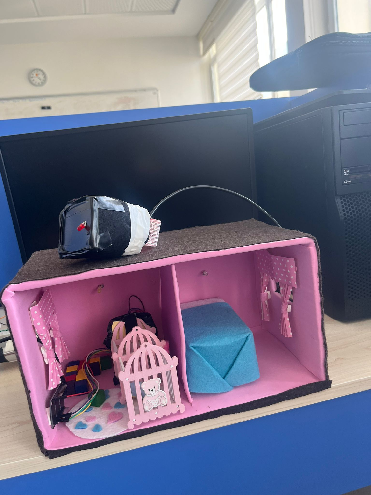
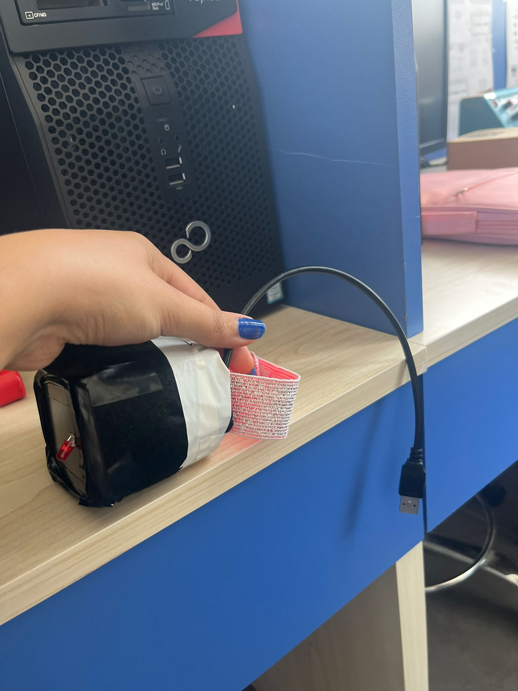
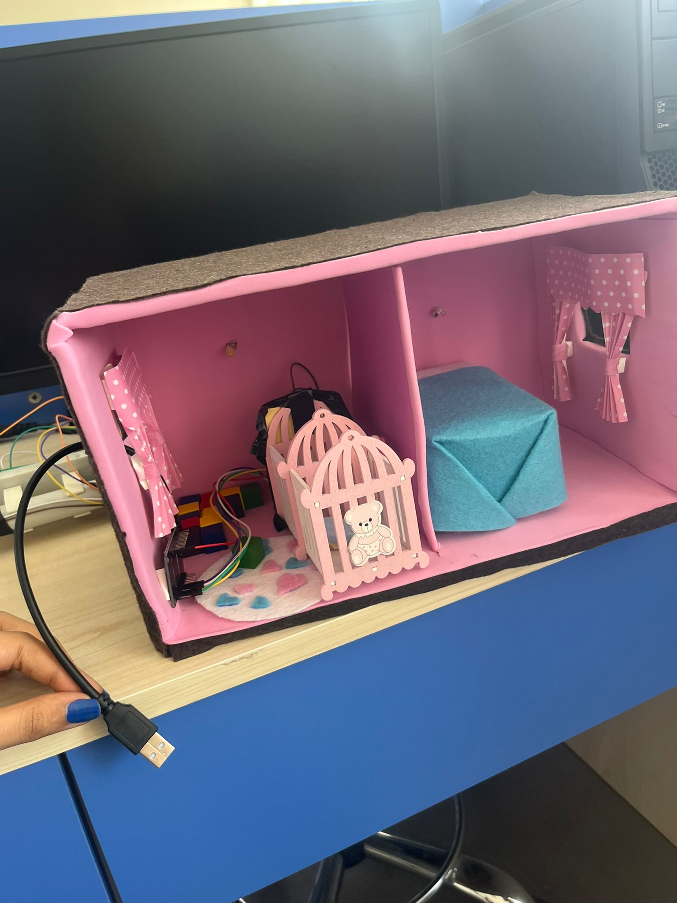

# Assistive Baby Monitoring System

An ESP8266-based assistive baby monitoring prototype designed to support deaf and hard-of-hearing mothers through simultaneous wearable, crib, and smart-home alerts.



## Overview

This project is an accessibility-focused baby monitoring system consisting of three wirelessly connected ESP8266 nodes:

- **Crib Monitoring Node**
- **Wearable Wristband Node**
- **Smart Home Alert Node**

The crib node monitors prolonged crying and inactivity. When an alert condition is detected, it sends an ESP-NOW message to the wearable wristband and smart-home unit.

The wristband provides vibration and LED feedback, while the smart-home unit produces a flashing visual warning. A dim light near the crib also turns on to provide temporary comfort until the caregiver arrives.

## Main Features

- Detection of prolonged high-volume sound
- Detection of extended inactivity
- Wireless communication using ESP-NOW
- Wearable vibration alert
- Wearable LED warning
- Smart-home flashing visual alert
- Dim crib lighting
- Seven-minute notification cooldown
- Independent operation without an internet connection

## System Architecture

```text
MAX4466 Microphone ─┐
                    ├──> Crib Node ──ESP-NOW──> Wearable Wristband
MPU6050 Sensor ─────┘           │
                                └──ESP-NOW──> Smart Home Alert Unit
```

## Alert Logic

### Cry Detection

A cry alert is triggered when the microphone detects sound above a configurable threshold for approximately 10 continuous seconds.

### Inactivity Detection

An inactivity alert is triggered when the MPU6050 detects no meaningful movement for approximately 20 minutes.

### Alert Response

When either condition is detected:

1. The wristband vibrates once.
2. The wristband warning LED turns on.
3. The smart-home warning LED begins flashing.
4. The crib light turns on.
5. The system enters a seven-minute cooldown period.

The visual alerts remain active until the corresponding device is disconnected from power.

## Hardware Components

### Crib Monitoring Node

- Wemos D1 Mini / ESP8266
- MAX4466 microphone sensor
- MPU6050 accelerometer and gyroscope
- LED for dim crib lighting
- Breadboard and jumper wires

### Wearable Wristband Node

- Wemos D1 Mini / ESP8266
- Mini vibration motor
- Warning LED
- NPN transistor
- Flyback diode
- Resistors and jumper wires

### Smart Home Alert Node

- Wemos D1 Mini / ESP8266
- Warning LED
- Resistor
- Breadboard and jumper wires

## Software and Technologies

- Arduino C/C++
- ESP8266
- ESP-NOW
- I2C communication
- Adafruit MPU6050 library
- Non-blocking timing with `millis()`

## Repository Structure

```text
assistive-baby-monitoring-system/
├── firmware/
│   ├── crib_node/
│   │   └── crib_node.ino
│   ├── wristband_node/
│   │   └── wristband_node.ino
│   └── smart_home_node/
│       └── smart_home_node.ino
├── images/
│   ├── prototype-overview.jpg
│   ├── wearable-wristband.jpg
│   └── crib-smart-home-prototype.jpg
├── LICENSE
└── README.md
```

## Prototype Images

### Wearable Wristband



### Crib and Smart Home Units



## Firmware Configuration

Before rebuilding the project, replace the placeholder receiver MAC addresses in:

```text
firmware/crib_node/crib_node.ino
```

Example:

```cpp
uint8_t wristbandAddress[] = {
  0x00, 0x00, 0x00, 0x00, 0x00, 0x00
};

uint8_t smartHomeAddress[] = {
  0x00, 0x00, 0x00, 0x00, 0x00, 0x00
};
```

The sound and movement thresholds must also be calibrated for the environment in which the system is used.

## Reconstruction Notice

The original physical prototype was built and demonstrated successfully. However, the original source-code files were not preserved.

The firmware included in this repository was reconstructed based on the original system architecture, hardware configuration, and project behaviour. The reconstructed firmware has not been retested on physical hardware.

## Limitations

- The reconstructed pin configuration may differ from the original prototype.
- Sensor thresholds require environmental calibration.
- ESP-NOW receiver MAC addresses must be configured manually.
- Alerts remain active until device power is disconnected.
- This project is an educational prototype and is not a certified medical or safety device.

## Future Improvements

- Add a physical alert-reset button
- Add battery-powered wearable operation
- Distinguish crying and inactivity through different vibration patterns
- Add battery-level monitoring
- Add encrypted ESP-NOW communication
- Design compact custom enclosures
- Add an optional mobile application

## Author

**Pelin Özdemir**  
Computer Engineering Student  
GitHub: [kingp4-cmyk](https://github.com/kingp4-cmyk)

## License

This project is licensed under the MIT License.
